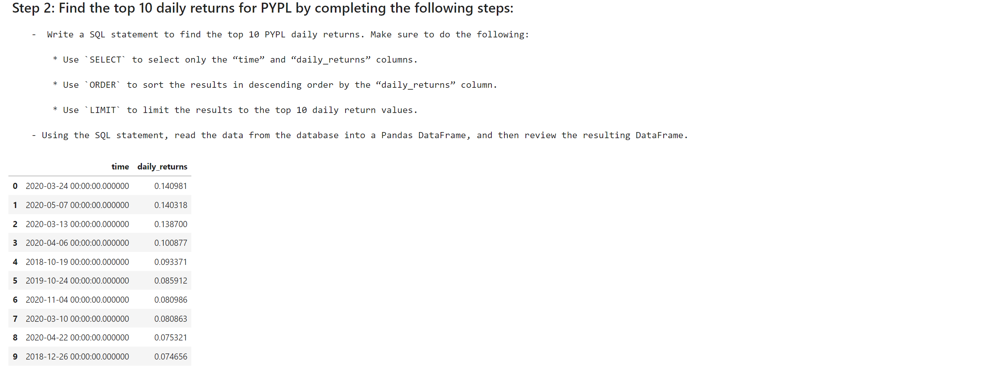

# UW-finctech-2022
# Module07-challenge
This is  apulblic repo for the Module 7 Challenge of the UW Fintech Bootcamp in 2022.
The challenge builds a financial database and web application by using SQL, Python, and the Voilà library to analyze the performance of a hypothetical fintech ETF.


## Technologies

Jupyter lab
pandas. 1.3.5
hvplot 0.8.0
sqlalchemy 1.4.32
voila0.2.16

## Installation Guide

Install jupyter lab by running the command jupyter lab in your terminal

Install the following libaries.

```
  Import hvplots
  Import panda as pd
  From pathlib import Path
  Import sqlalchemy
  Install Voila
  
```


## Usage

Application of Jupyter Lab build a financial database and web application by using SQL, Python, and the Voilà library to analyze the performance of a hypothetical fintech ETF.





****


---

## Contributors


## License
 The code is made without a license, howber, the materials used for research are licensed.
---


